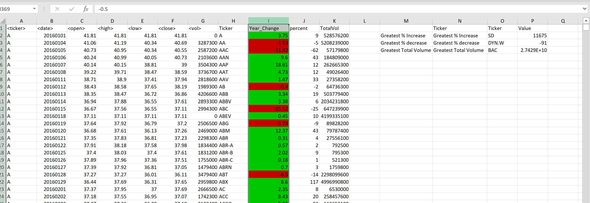
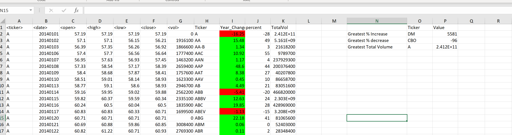

# VBA-Challenge
Here I have created a VBA code to do Stock Market Analysis.

## Background

As part of Rutgers Bootcamp VBA Challenge I was provided with an excels sheet containing real stock Market Data. Idea was to write a code to analyse the data and diffrent challenge levels were provided. I went for the Mastery Challenge. A+ or A I had super fun and enjoyed every bit of the coding part!!!! 

### Before we get started

1. Created a Repository named `VBA-challenge`.

2. Added the VBA File and Images in this repository

### Stock market analyst

## Lets Get Started

* Created a script that will loop through all the stocks for one year and output the following information.

  * The ticker symbol.

  * Yearly change from opening price at the beginning of a given year to the closing price at the end of that year.

  * The percent change from opening price at the beginning of a given year to the closing price at the end of that year.

  * The total stock volume of the stock.

*  applied conditional formatting that will highlight positive change in green and negative change in red.

* The result should look as follows.

## Masters always go for BONUS!!!!

* My solution was also able to return the stock with the "Greatest % increase", "Greatest % decrease" and "Greatest total volume". The solution looked as follows:

!2015](Images/Screenshot 2015.png)

* Made appropriate adjustments to  VBA script that will allow it to run on every worksheet, i.e., every year, just by running the VBA script once.

